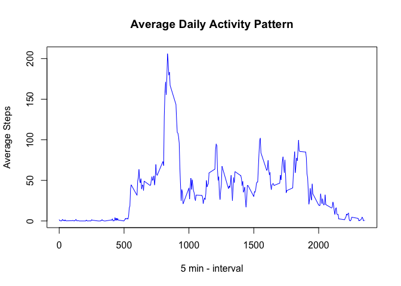

# Reproducible Research: Peer Assessment 1


## Loading and preprocessing the data
#### No preprocessing needed


```r
datazipname <- "activity.zip"
datafile <- "activity.csv"
## If data is not unzipped, unzip it
if (!file.exists(datafile)) {
  unzip(datazipname)
}
data<-read.csv("activity.csv")
str(data)
```

```
## 'data.frame':	17568 obs. of  3 variables:
##  $ steps   : int  NA NA NA NA NA NA NA NA NA NA ...
##  $ date    : Factor w/ 61 levels "2012-10-01","2012-10-02",..: 1 1 1 1 1 1 1 1 1 1 ...
##  $ interval: int  0 5 10 15 20 25 30 35 40 45 ...
```

```r
summary(data)
```

```
##      steps                date          interval     
##  Min.   :  0.00   2012-10-01:  288   Min.   :   0.0  
##  1st Qu.:  0.00   2012-10-02:  288   1st Qu.: 588.8  
##  Median :  0.00   2012-10-03:  288   Median :1177.5  
##  Mean   : 37.38   2012-10-04:  288   Mean   :1177.5  
##  3rd Qu.: 12.00   2012-10-05:  288   3rd Qu.:1766.2  
##  Max.   :806.00   2012-10-06:  288   Max.   :2355.0  
##  NA's   :2304     (Other)   :15840
```


## What is mean total number of steps taken per day?


```r
library(dplyr)
```

```
## 
## Attaching package: 'dplyr'
```

```
## The following objects are masked from 'package:stats':
## 
##     filter, lag
```

```
## The following objects are masked from 'package:base':
## 
##     intersect, setdiff, setequal, union
```

```r
bydate<-summarise(group_by(data, date), steps=sum(steps))
hist(bydate$steps,main="Histogram of Total Number of Steps Taken per Day", 
     xlab="Total Number of Steps Taken per Day", 
     border="blue", 
     col="green"
     )
```

<!-- -->

```r
mymean<-mean(bydate$steps, na.rm=TRUE)
mymean
```

```
## [1] 10766.19
```

```r
mymedian<-median(bydate$steps, na.rm=TRUE)
mymedian
```

```
## [1] 10765
```
#### The mean total number of steps taken per day is 1.0766189\times 10^{4}
#### The median total number of steps taken per day is 10765


## What is the average daily activity pattern?


```r
byinterval <- data %>%
           group_by(interval) %>%
           summarise(StepsInterval=mean(steps,na.rm=TRUE))
with( byinterval, plot(interval,StepsInterval,
                    type="l",
                    col="blue",
                    main="Average Daily Activity Pattern",
                    xlab="5 min - interval",
                    ylab="Average Steps"))
```

<!-- -->

```r
mymax<-with(byinterval, interval[which.max(StepsInterval)])
```

#### 1. The 5-minute interval, on average across all the days in the dataset, which contains the maximum number of steps is 835


## Imputing missing values

#### Used the interval mean number of steps to replace missing steps.


```r
n1<-sum(is.na(data$steps))
n2<-sum(is.na(data$date))
n3<-sum(is.na(data$interval))
myjoin<-inner_join(data,byinterval,by=c("interval")) %>%
mutate( steps=ifelse(is.na(steps),StepsInterval,steps))
```
#### The count of missing step information is 2304
#### The count of missing date information is 0
#### The count of missing interval information is 0

#### Myjoin is my table with the missing data filled in

```r
nudata <- myjoin %>%
           group_by(date) %>%
           summarise(TotalDaily=sum(steps))
```


```r
mymean<-mean(nudata$TotalDaily)

mymedian<-median(nudata$TotalDaily)
```
#### The mean total number of steps taken per day after filling the data is 1.0766189\times 10^{4}
#### The median total number of steps taken per day after filling the data is 1.0766189\times 10^{4}
#### The impact of filling the missing data is so small to be hardly noticeable

```r
hist(nudata$TotalDaily,main="Histogram of Total Number of Steps Taken per Day", 
     xlab="Total Number of Steps Taken per Day", 
     border="black", 
     col="blue"
     )
```

<!-- -->


## Are there differences in activity patterns between weekdays and weekends?

#### The difference between weekdays and weekends is that weeksdays have a very 
#### large peak at 835 and nothing coming close the rest of the day.
#### Weekends don't have any large peaks similar to weekdays, but, overall,
#### the amount of activity is greater than the weekdays.


```r
library(lubridate)
```

```
## 
## Attaching package: 'lubridate'
```

```
## The following object is masked from 'package:base':
## 
##     date
```

```r
myjoin<-myjoin %>% 
         mutate(daytype=as.factor(ifelse(wday(date) %in% c(1,7),"weekend","weekday")))

library(lattice)
myjoin<- myjoin %>% 
          group_by(daytype,interval) %>%
          summarise(meansteps=mean(steps))
with (myjoin, 
      xyplot(meansteps ~ interval|daytype, type="l", 
             ylab="Number of steps",layout=c(1,2)))
```

<!-- -->
